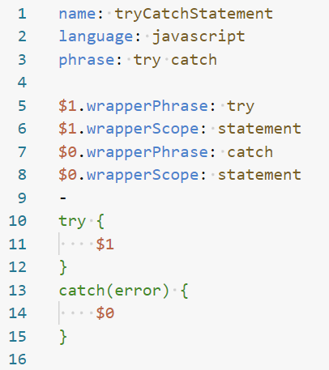

# Snippet Browser

A Visual Studio Code extension that discovers, filters, and inserts Talon-style `.snippet` files from a local folder.


## Features

- **Browse & Filter**: Use the Command Palette to select a language (or _All_) and pick from available snippets.
- **Configurable Folder**: Set your snippet directory with `Snippet Browser: Set Snippet Folder` or via the `snippetbrowser.snippetPath` setting.
- **Quick C# Inserts**: One-command insertion of common C# `if` and `for` snippets.
- **Auto-Prompt**: On first use (when no folder is defined), prompts you to select the snippet folder.

## Commands

| Command                                 | ID                               | Description                                 |
| --------------------------------------- | -------------------------------- | ------------------------------------------- |
| Snippet Browser: Open                   | `snippetbrowser.open`            | Browse languages and insert a snippet       |
| Snippet Browser: Set Snippet Folder     | `snippetbrowser.setSnippetPath`  | Configure or change your `.snippet` folder  |
| Snippet Browser: Insert C# If Statement | `snippetbrowser.insertIfCsharp`  | Quickly insert the C# `ifStatement` snippet |
| Snippet Browser: Insert C# For Loop     | `snippetbrowser.insertForCsharp` | Quickly insert the C# `for` loop snippet    |

## Configuration

```jsonc
// in settings.json
autoComplete: false,
{
  "snippetbrowser.snippetPath": "", // set to your .snippet folder path
}
```

- **snippetbrowser.snippetPath**: (string) Absolute or workspace-relative path to your `.snippet` files folder.

## Snippet File Format

A `.snippet` file uses a custom YAML-like format to define Talon-style snippets. Here's how it works:

### Features

- Custom file extension `.snippet`.
- Supports syntax highlighting and auto-formatting via the [andreas-talon](https://marketplace.visualstudio.com/items?itemName=AndreasArvidsson.andreas-talon) VS Code extension.
- Supports both insertion and wrapper snippets (wrapper snippets require [Cursorless](https://www.cursorless.org)).
- Allows phrase formatters to transform spoken phrases.

### Format

- Use `---` on a line by itself to separate multiple snippet documents in one file.
- Within each document, use a single `-` line to separate the context metadata (above) from the snippet body (below).
- Optionally include a top-level context block (no body) to define default values inherited by following documents.
- Context keys that support multiple values use `|` to separate entries (e.g., `language: javascript | java`).

### Context Fields

| Key            | Required | Multiple Values | Example                     |
| -------------- | -------- | --------------- | --------------------------- |
| name           | Yes      | No              | `name: ifStatement`         |
| description    | No       | No              | `description: My snippet`   |
| language       | No       | Yes             | `language: javascript       | java` |
| phrase         | No       | Yes             | `phrase: if                 | else` |
| insertionScope | No       | Yes             | `insertionScope: statement` |

- `name`: Unique identifier for the snippet.
- `description`: A human-readable explanation.
- `language`: Language ID(s) in which the snippet is active.
- `phrase`: Spoken phrases to trigger insertion.
- `insertionScope`: Insertion context for wrapper/snippet tools.

### Variables for Tab Stops & Wrappers

You can also define context for individual tab stops (e.g., `$0`, `$1`) or variables:

| Key                | Required | Multiple Values | Example                             |
| ------------------ | -------- | --------------- | ----------------------------------- |
| insertionFormatter | No       | Yes             | `$0.insertionFormatter: SNAKE_CASE` |
| wrapperPhrase      | No       | Yes             | `$0.wrapperPhrase: try              | trying` |
| wrapperScope       | No       | No              | `$0.wrapperScope: statement`        |

- `insertionFormatter`: Formatter applied to the inserted phrase.
- `wrapperPhrase`: Spoken form for wrapper snippets (Cursorless).
- `wrapperScope`: Scope used when wrapping.

### Formatting & Examples

To enable formatting, code completion, and syntax highlighting for `.snippet` files, install the **andreas-talon** extension.

#### Single snippet definition



#### Multiple snippet definitions


#### Default context and multiple values


## Usage

1. Press `Ctrl+Shift+P` and run **Snippet Browser: Open**.
2. Select a language (or **All**).
3. Pick a snippet by name (see description and phrase hints).
4. Snippet code will be inserted at your cursor.

> On first run, if no snippet folder is configured, an open-folder dialog will prompt you to select it automatically.

## Build & Test

```pwsh
# Install deps
npm install

# Compile
npm run compile
# or watch mode
npm run watch

# Run & Debug
# Press F5 in VS Code to launch the Extension Development Host

# Lint & Test
npm run lint
npm test
```

## Package & Publish

```pwsh
# Bump version in package.json
# Compile before publishing
npm run compile
# Create .vsix
envs, vsce package
# Publish to Marketplace
envs, vsce publish
```

---

For more information, see the [extension guidelines](https://code.visualstudio.com/api/references/extension-guidelines) and the [snippet format spec](SnippetBrowser.md).
